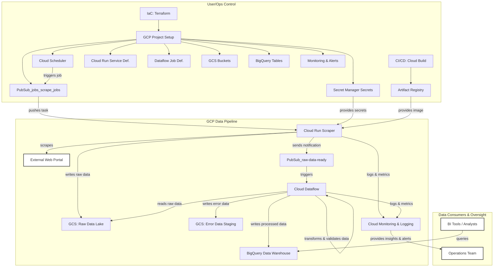

# Proposed architecture: Google Cloud-Based Web Scraping Solution

This document outlines a plan for deploying the web scraper on Google Cloud Platform (GCP), focusing on building a data pipeline that is resilient, scalable, and maintainable for extracting product inventory data.

## 1. ☁️ Core GCP Services for the Scraping Pipeline

GCP services used for this pipeline:

* **Cloud Run:** Hosts the containerized Python scraper (built as described in the `system_design` document, Section 1). Its serverless nature allows for automatic scaling with costs based on execution time. Docker images are stored in **Artifact Registry** and deployed via an automated CI/CD pipeline (e.g., **Cloud Build**).
* **Cloud Scheduler:** Reliably triggers scraping jobs on a defined schedule.
* **Cloud Storage (GCS):** Serves as the central storage solution for:
    * A **Raw Data Lake:** Storing immediate HTML/JSON output from scrapes (e.g., `gs://<bucket>/raw/<portal>/<date>/`).
    * **Processed Data Staging:** Optionally, for cleaned data before loading into BigQuery.
    * **Scraper Configurations:** Portal-specific settings (URLs, selectors).
* **Cloud Pub/Sub:** Acts as the messaging backbone, decoupling services. It manages a task queue for portals to be scraped and handles notifications (e.g., "scrape complete," errors). Dead Letter Topics (DLTs) will be used to catch and manage messages that fail processing.
* **Cloud Dataflow:** Transforms raw scraped data. It handles parsing, cleaning, validation (e.g., ensuring 'Author', 'Tags', and 'goodreads.com reference' are present and correctly formatted), and structuring data for its final destination.
* **BigQuery:** Serves as the analytical data warehouse for processed and structured quote data, ready for querying.
* **Secret Manager:** Securely stores sensitive credentials like portal logins and API keys. Cloud Run services access these via IAM permissions.
* **Cloud Monitoring & Logging:** Provides essential visibility into pipeline performance and health. Structured logs from the scraper aid in diagnostics, and alerts can be configured for critical events.
* **Infrastructure Management:** The overall GCP infrastructure will be managed as code (e.g., using **Terraform**) for consistency, repeatability, and version control of the environment.

## 2. ⚙️ Pipeline Architecture and Workflow

These services interact as follows to create an automated scraping pipeline:

1.  **Job Trigger & Task Queuing:**
    * Cloud Scheduler initiates the process by sending a message to a Pub/Sub "scrape-jobs" topic. Each message can specify a portal or carry its configuration.

2.  **Scraping Execution (Cloud Run):**
    * A Cloud Run service, subscribed to the "scrape-jobs" topic, processes incoming tasks.
    * It fetches necessary credentials from Secret Manager and the relevant portal-specific configuration (e.g., from GCS).
    * The scraper then executes its core logic (authentication, pagination, data extraction – as detailed in the `system_design` document, Section 1). Resilience features like retries and session management are handled within the scraper application.
    * Raw extracted data (HTML, raw JSON) is saved to the GCS Raw Data Lake.
    * Upon completion (or error), the scraper publishes a message to a "raw-data-ready" Pub/Sub topic, including the GCS path to the raw data.

3.  **Data Processing (Cloud Dataflow):**
    * The "raw-data-ready" message triggers a Cloud Dataflow job.
    * Dataflow reads the raw data from GCS, then performs transformations: cleaning, validating data integrity (e.g., fields are present, URLs are valid), and structuring it according to a predefined schema.
    * Data that fails validation can be routed to a separate GCS location or a specific BigQuery table for review.

4.  **Data Loading & Storage (BigQuery):**
    * Dataflow loads the processed, validated data into designated BigQuery tables. Each record will include identifiers like `portal_name` and `scrape_date` for tracking and segmentation.

5.  **Monitoring, Maintenance, and Scaling:**
    * **Monitoring:** Cloud Monitoring dashboards provide an overview of pipeline health (scrape success/failure rates, data volumes, processing times). Alerts provide notification for critical issues like job failures or a spike in errors. Proactive checks for website structure changes can also be implemented and integrated with alerting.
    * **Maintenance:** The established CI/CD pipeline (Cloud Build) automates deployments, while IaC (Terraform) ensures consistent infrastructure management. Updates to scraper configurations, centrally managed in GCS or Firestore, are part of this streamlined maintenance process.
    * **Scaling:** The serverless nature of Cloud Run, Pub/Sub, and Dataflow allows the pipeline to scale automatically with the number of portals or data volume. 
    * **Security:** IAM will be used with the principle of least privilege (e.g., Workload Identity for Cloud Run accessing secrets). Data is encrypted in transit and at rest by GCP.

## 3. Architecture Diagram

This diagram visualizes the flow and interaction of the GCP services:

> **Note:**  
> If you can't see the graph (either by the image or rendering), you can view it [here](https://www.mermaidchart.com/raw/86787b77-f098-45be-b224-7a6afc5c28f8?theme=light&version=v0.1&format=svg).  
> If the link is broken, try copying and pasting the raw graph code into [Mermaid Live Editor](https://www.mermaidchart.com).

